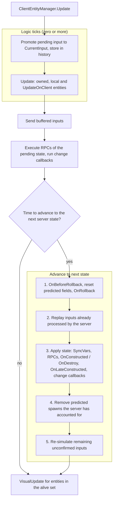

# Client-side prediction and rollback

The owning client does not wait for the server: it applies input to its own entities immediately and shows the result. When the authoritative state arrives, the client resets those entities to it and replays the inputs the server has not processed yet — a rollback — so a correct prediction is invisible and a wrong one is quietly fixed.

## What is predicted

Only entities the local player owns, and only their predicted fields. Everything else on the client is a replay of server state, smoothed by [interpolation](interpolation.md).

| | Predicted | Rolled back |
|---|---|---|
| Owned entity, normal field | yes | yes |
| Owned entity, `NeverRollBack` field | yes | no — keeps the server value |
| Remote entity, normal field | no | no |
| Remote entity, `AlwaysRollback` field | yes, if client code writes it | yes |
| Local predicted spawn | yes | yes, from its creation tick onward |

Details of that choice per field are in [controlling rollback](rollback-per-field.md).

## The rollback sequence

When the client decides to advance to the next server state, this happens in one go, before any of it is rendered:

1. **Reset.** For every entity with predicted changes: `OnBeforeRollback()`, then predicted fields are restored to the last values the server confirmed, then `OnRollback()` on the entity and on its custom-rollback syncable fields.
2. **Catch-up replay.** Stored inputs the server has already processed are replayed once, so the entity reaches the state matching the server's processed tick — this is what makes change callbacks fire against the right baseline.
3. **Apply the new state.** RPCs of that state execute, SyncVars take their authoritative values, construction callbacks and change notifications run.
4. **Clean up predicted spawns.** Locally spawned predicted entities the server has now accounted for are removed — replaced by the real ones that arrived in step 3.
5. **Re-simulate.** `UpdateMode` switches to `PredictionRollback` and every remaining unconfirmed input is replayed in order: for each tick the controller's `CurrentInput` is loaded from history and the owned entities' `Update()` runs again.
6. **Resume.** The tick counter returns to the client's current tick and normal simulation continues.

Steps 1, 2 and 5 run with `EntityManager.InRollBackState == true`.

## The client frame in full

Where that sequence sits inside one call to the client manager's `Update()`:



Steps 1, 2 and 5 of `GoToNextState` are the rollback; everything else is ordinary frame work. The mirror image on the other side is in [server update flow](server-update-flow.md).

## Writing rollback-safe code

`Update()` of a predicted entity may run many times for the same tick. Everything in it must be a pure function of state and input:

```csharp
protected override void Update()
{
    // fine: derived from state + input, identical every replay
    Position.Value += _velocity * EntityManager.DeltaTimeF;

    if (_health.Value <= 0 && EntityManager.InNormalState)
        SpawnDeathEffect();   // one-shot: guard it
}
```

Rules that follow:

* **Side effects need `InNormalState`.** Sounds, particles, camera shake, UI messages — anything the player perceives once. Without the gate, every correction replays them.
* **No nondeterministic sources.** Wall-clock time, unseeded randomness, engine frame time, live input polling — all produce different results on replay. Use `EntityManager.Tick`, `DeltaTimeF`, and input from history.
* **No engine writes.** Do not move transforms or spawn objects from predicted `Update`; write to SyncVars and let views read [interpolated values](interpolation.md).
* **Keep plain fields consistent.** Non-`SyncVar` fields are not reset by rollback. A plain accumulator that `Update` mutates will drift with every replay — derive such values from synchronized state instead, or accept that they are view-only.

## Determinism expectations

Prediction does not require bit-exact float determinism: plain floats and kinematic movement (character-controller style) run stably, and small divergences are absorbed by the correction. What does not work out of the box is full rigidbody physics — rewinding a physics engine needs control it usually does not expose. Predicting kinematic motion and validating hits with [lag compensation](lag-compensation-in-depth.md) covers most shooter and action needs.

> [!WARNING]
> **Common mistakes**
>
> * One-shot effects in predicted `Update` without `InNormalState` — they fire again on every correction.
> * Randomness or wall-clock time in predicted code — every replay computes something different, and the entity visibly fights the server.
> * Expecting plain C# fields to be rewound — only predicted SyncVars and custom-rollback syncable fields are; everything else keeps whatever the last replay left.
> * Polling input inside `Update` — re-simulation would feed the current frame's input into a past tick.

## Related pages

- [rollback-per-field.md](rollback-per-field.md)
- [predicted-spawning.md](predicted-spawning.md)
