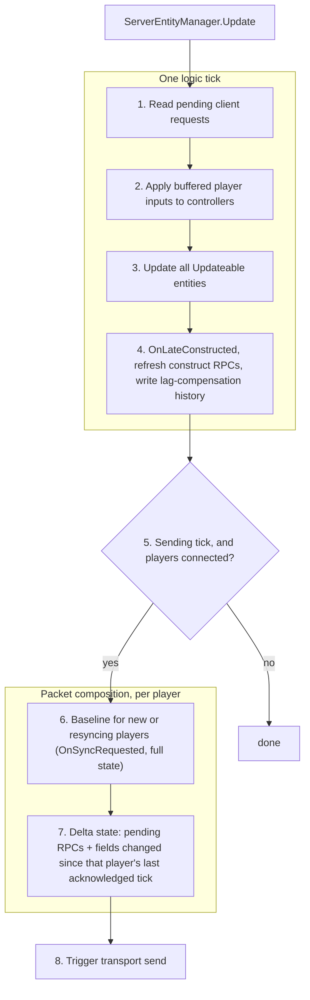

# Server update flow

Under the hood, one server tick is a fixed sequence: consume what clients sent, advance the simulation, record history, then — on sending ticks — compose a packet per player. Knowing the order explains most "why did this run before that" questions.

## The sequence

## Step by step

### 1. Client requests

Reliable [requests](../sync/client-requests.md) that arrived since the previous tick are decoded and their handlers run — before any entity updates, so a request's effects are visible to the whole tick.

Requests travel on a reliable ordered channel while inputs travel unreliably, so a request is not synchronized with the input stream: it lands on the tick it arrived for, not on the tick the player pressed the button.

### 2. Inputs

For each player, the input matching the tick being simulated is taken from their buffer and written to `CurrentInput` on their controllers. A missing input leaves the previous one in effect. Bots have no network input — their controllers produce commands directly in `BeforeControlledUpdate`.

### 3. Entity updates

Every entity with `EntityFlags.Updateable` runs `Update()`, in creation order. This is where the authoritative simulation happens: movement from input, collisions, hit checks (with [lag compensation](lag-compensation-in-depth.md) if the entity asks for it), damage, destruction.

Entities created during this step do not update on the tick they were created — they start with the next one.

### 4. Post-update bookkeeping

`OnLateConstructed` runs for everything constructed this tick. Construct RPCs created earlier in the tick are refreshed so they carry the entity's state *after* the update rather than at the moment of creation. Then the current values of every `LagCompensated` field are written into history.

### 5. Send gate

State is composed only on ticks that match [`ServerSendRate`](tick-model.md), and only if at least one player is connected. Otherwise the tick ends here — the simulation keeps running regardless.

### 6. Baselines

A player who just connected, or one who has fallen too far behind to patch incrementally, gets a full state. Composing it calls `OnSyncRequested` on entities and syncable fields, which is how [syncable types](../sync/syncablefield-basics.md) re-send their entire contents. The baseline is sent reliably and compressed.

### 7. Delta states

For every other player, one packet carries their pending RPCs plus the fields that changed since the last state that player acknowledged. Each RPC carries its tick so the client can execute it at the right moment instead of in a burst after a lag spike. [Sync groups](../sync/sync-groups.md) and per-field visibility are applied here, per player.

### 8. Flush

The transport is told to send now rather than at its own next opportunity, shaving a few milliseconds off the round trip.

> [!NOTE]
> Local singletons implementing `ILocalSingletonWithUpdate` are driven around this sequence: `Update` before the tick's work and `LateUpdate` after the entity updates.

## Related pages

- [prediction-and-rollback.md](prediction-and-rollback.md)
- [../sync/how-state-syncs.md](../sync/how-state-syncs.md)
